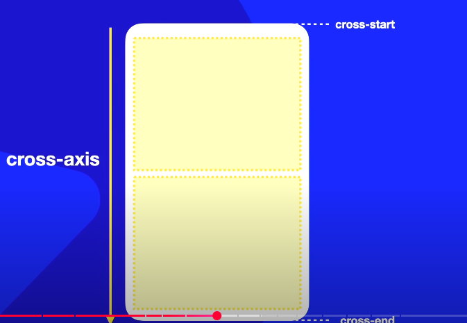
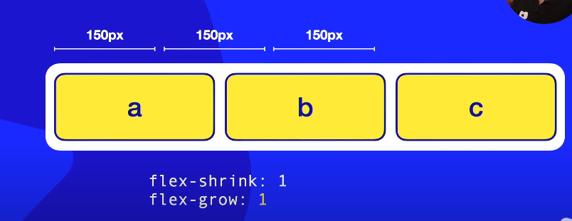
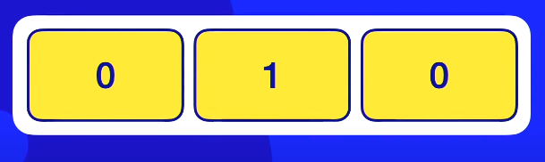
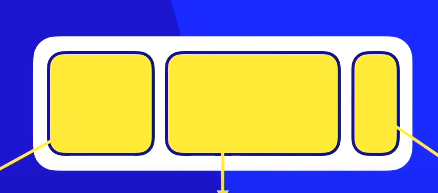

# Tópicos

[Flex-box](#flex-box)

[Direções e eixos](#direções-e-eixos)

[Empacotamento e fluxo no Flexbox](#empacotamento-e-fluxo-no-flexbox)

[Alinhamento nos eixos Flebox](#alinhamento-nos-eixos-flebox)

[Centralização Absoluta Flexbox](#centralização-absoluta-flexbox)

[ Alinhamento de elementos empacotados](#alinhamento-de-elementos-empacotados)

[Anatomia dos itens Flexbox](#anatomia-dos-itens-flexbox)

[Propriedade flex-basis](#propriedade-flex-basis)

[Controle do tamanho de itens flexíveis](#controle-do-tamanho-de-itens-flexíveis)

[Propriedade Flex](#propriedade-flex)

# Flex-box

Qual é o formato da água?

Se eu por no jarro, é um formato de um jarro
Se eu por na garrafa é um formato de uma garrafa
Se eu por no copo é o formato de um copo

A forma da água vai depender do recepiente em que ela estiver

 

O flexbox é para resolver problemas onde as caixas não estão se encaixando. Ele cria um layout mega flexível para adaptar o conteúdo

No flexbox nós não conseguimos dizer efetivamente o tamanho da caixa, o conteúdo da caixa e o contener nela, vão definir o tamanho e formato dela.

Dentro dessas caixas flexíveis nós podemos criar caixas dentro que chamamos de **itens**

Oque acontece se eu não usar o Flex Box Module?

Se eu alterar o formato do contener de fora, o contener de dentro não irá se adaptar, gerando um transbordamento

Agora com o Flex Box:

a grande maioria dos celular e computadores suportam flexbox hoje em dia, entretanto, algumas smarTvs antigas podem não suportar

Se eu der uma reduzida na caixa de fora:

elas se tornaram **fluídas**

Eu posso escolher a posição dos itens

Quando usamos o flexbox a propriedade **stretch** ja vem ligada que estica e encolhe dinamicamente

Também podemos configurar pra ter um deslocamento inferior

Podemos fazer com que essa caixa que quebrou fique adaptável ao contenner

Também podemos reconfigurar o flexbox para trabalhar com caixas verticalmente alinhadas

E que também podem se adaptar

**Só colocamos o display flex no contenner**

**Os itens não vão receber a configuração do display flex, eles vão receber outras configurações**

Flex-container = Pai

Flex-items = filhos

# Direções e Eixos

## Direções
As configurações de direções são realizadas no pai

### Propriedades do flex-direction

Por padrão a propriedade é **flex-direction: row;**
da esquerda pra direita (direção da leitura)

**flex-direction: row-reverse;** - Modo reverso, os elementos serão postos da direita pra esquerda

**flex-direction: row-column;** - Elementos serão postos de cima pra baixo muito utilizado pra celulares

**flex-direction: column-reverse;** - Os elementos serão postos de baixo para cima

## Eixos

### Propriedades do main-axis

O primeiro eixo que é criado é o eixo principal, conhecido como **main-axis**. Cada eixo possui dois pontos, o ponto inicial e o ponto final, **main-start** e **main-end**

### Propriedades do eixo transversal cross-axis

O principal eixo transversal que é criado é conhecido como **cross-axis**. Cada eixo possui dois pontos, o ponto inicial e o ponto final, **cross-start** e **cross-end**

> Quando o flex direction row estiver configurado por padrão no nosso idioma

> Quando o flex direction row-reverser estiver configurado o main-axis inverte e o cross-axis não tem inversão

> Quando o flex direction column estiver configurado o main-axis vai de cima pra baixo e o cross-axis segue a direção padrão que é da esquerda pra direita

> Quando o flex direction column-reverse estiver configurado o main-axis vai de baixo pra cima e o cross-axis segue a direção padrão que é da esquerda pra direita

# Empacotamento e fluxo no Flexbox

## Flex-wrap

### nowrap

Configura o comportamento da capsula/contêiner. Por padrão ele vem configurado como **flex-wrap: nowrap;**. nowrap = não encapsule / não quebre os conteúdos

Eu tinha um espaço vazio, agora não tenho mais, oque vai acontecer se esse conteiner diminuir ainda mais?

>Se eu diminuir eles vão encolher. O encolhimento dos blocos vão depender do conteúdo que existe nele

Com a propriedade **nowrap** que vem como padrão diz "não quebre, não faça com que os blocos saiam da sequência ordenada"

Quando põe display:flex em um pai, ele ja vem como padrão o **nowrap**

### wrap

>Quando diminui o comportamento é exatamente igual ao nowrap

>A partir do momento que acaba o espaço e tento diminuir, ele vai pegar o último elemento e vai quebrar ele no sentido do eixo transversal

### wrap-reverse

>Quando ele diminuir depois do limite dos conteúdos, ele vai ter a quebra no sentido oposto do eixo transversal

## Resumo

> Ele sempre está seguindo no sentido do cross-axis

> Vai fazer com que a quebra aconteça no sentido oposto ao eixo transversal

## Flex-flow

Flex-flow é uma junção entre flex-direction com flex-wrap. Ele é um *shorthand* basicamente

# Alinhamento nos eixos Flebox

Vamos aprender sobre as propriedades **justify-content** e **align-items**. Essas duas propriedades são configuráveis dentro do contêiner

Vamos aprender como alinhar os itens tanto no eixo principal como no eixo transversal

## Alinhamento do eixo principal: Justify-content

Irá fazer o alinhamento em relação ao *main-axis*, ao eixo principal. Se o *main-axis* for em pé com as configurações *column* ele vai alinhar verticalmente.

### justify-content: flex-start

É a configuração de alinhamento padrão.

**flex-start** está relacionado ao *main-start*. O primeiro item vai ficar grudado exatamente no *main-start*. Caso exista um espaço livre, **o espaço livre vai ficar sempre no final, perto do main-end**

### justify-content: flex-end

**flex-end** está relacionado ao *main-start*. O último item vai ficar grudado exatamente no *main-end*. Caso exista um espaço livre, **o espaço livre vai ficar todo condencado, perto do main-stat**

### justify-content: center

Ele vai calcular o centro do conteiner, coloca todos os itens juntos nesse center, no meio do main-axis, e os espaços em branco vão ser distribuídos de forma igual

### justify-content: space-between

È uma configuração de espaçamento que coloca o primeiro item no main-start e o ultimo item no main-end. Todos os outros item vão estar no meio com o espaçamento entre eles iguais.

### justify-content: space-evenly

È uma configuração de espaçamento que não irá grudar o primeiro e o ultimo elemento nas extremidades do conteiner. Ele irá colocar os elementos dispostos dentro do contêiner de forma que antes e depois dos itens nós tenhamos espaçamentos iguais

É a configuração mais simétrica de todas as outras

### justify-content: space-around

Vai fazer uma conta diferente. Quantos elementos o meu flex-box vai ter? 3 elementos. Então ele vai pegar o espaço útil do conteinêr, vai dividir os espaços em 3 pedaços iguais e vai centralizar os itens dentro desses espaços.

> Entre os elementos existem dois espaços, um que é o final do anterior, e o outro que é o ínicio do posterior

### Resumo

## Alinhamento do eixo transversal: align-items

Irá funcionar sempre no sentido do cross-exis que é o eixo transversal, se for com a configuração row, é de cima pra baixo.

Para poder alinhar no cross-axis precisará aumentar a altura do conteiner.

Por padrão é **stretch**

### align-items: stretch

Se aumentar o cross-axis ele irá esticar os elementos

>Os itens irão se esticar

### align-items: flex-start

Vai fazer os elementos grudarem no ínicio do eixo transversal, deixando um espaço vazio no final do eixo transversal

### align-items: flex-end

Vai fazer os elementos grudarem no final do eixo transversal, deixando um espaço vazio no inicio do eixo transversal

### align-items: center

Vai fazer os elementos grudarem no centro do eixo transversal, deixando um espaço vazio no inicio do eixo transversal e no final do eixo transversal

O align-items não tem configurações de espaçamento como o space-around, space-between e space-evenly existe uma outra propriedade que faz isso.

# Centralização Absoluta Flexbox

**Objetivo:**

Idependente do formato do conteiner o item vai ficar sempre no meio

Se eu mudar a qualquer momento o formato do conteiner

> O item continua centralizado

> O item continua centralizado. 

> Coloco essas duas propriedades com o valor center. Sempre no conteiner

# Alinhamento de elementos empacotados

Elemento empacotado é aquele que se quebra. Quando utilizados a propriedade **wrap**

E se eu ampliar o conteiner?

> NÃO ACONTECE ISSO NA PRÁTICA

> Precisamos decidir oque fazer com esse espaço em branco

> A propriedade align-content vai decidir isso

Muita gente confunde **align-content** com **justify-content** e **align-items**

**justify-content** Vai alinhar os itens dentro do eixo principal

**align-items** Vai alinhar os itens dentro do eixo transversal

**align-content** Vai alinhar os elementos no deixo transversal, mas **QUANDO ELES ESTÃO EMPACOTADOS**

## align-content: stretch

Elemento padrão é dado pelo valor stretch

Vai pegar a dimensão inteira, no caso altura, e vai dividir em duas partes iguais, ou de acordo com o tamanho do conteinner.

O stretch vai pegar toda a área disponível e vai dividir pelo número de linhas ou colunas. Vai por os itens dentro pegando a dimensão do cross-axis de todos os itens e puxar pra baixo.

Exemplo:

## align-content: flex-start

Vai pegar todos os elementos e colocar grudados no cross-start reservando o espaço em branco de baixo grudado no cross-end.

## align-content: flex-end

Vai pegar todos os elementos e colocar grudados no cross-end reservando o espaço de cima grudado no cross-start para colocar o espaço em branco.

## align-content: center

Vai pegar os elementos quebrados e alinhar no centro, criando no cross-start e no cross-end espaços em branco iguais.

## align-content: space-between

Vai pegar os primeiros elementos e colocar perto do cross-start. Vai pegar os últimos elementos e colocar perto do cross-end, e o espaço no meio ele vai dividir com outros itens que porventura irão existir.

## align-content: space-evenly

Coloca espaços no cross-start e no cross-end. Esse espaço é calculado para que eu coloque os elementos, e entre esses elementos também exista exatamente o mesmo espaçamento.

## align-content: space-around

Divide o eixo transversal em partes iguais, colocando os elementos dentro dessas áreas demarcadas e vai centralizar os itens

> Não vai fazer a puxadinha que o Stretch faz

# Anatomia dos itens Flexbox

Quando criamos conteiner flexbox, a parte de fora é flex, entretanto, a parte de dentro não é flex. Mais eu posso pegar 1 ou mais itens e torna-los conteiners. Mais se eu fizer isso vai começar a bagunçar e dificultar a visão tornando muito avançado.

Iremos trabalhar por enquanto com os elementos pai sendo flex e o elementos filho não flex.

## order 

Todo o item em flexbox que estiver dentro do pai vai ter **ordem:0** por padrão

Caso deseje modificar a ordem de posição dos elementos terá que aplicar a propriedade order com valores diferentes

O próprio CSS vai ordenar para que esse itens fique em orde crescente, dessa maneira:

## align-self

Ele se aplica aos itens e vai funcionar diretamente no cross-axis. Ele não serve para conteiner/pais, somente para filhos/itens.

Com essa propriedade eu consigo alterar o comportamento do alinhamento individual de cada elemento dentro do cross-axis

>O valor auto vai herdar as características de alinhamento vertical do seu pai. Seja ele o align-content ou align-items

>Alinhamento perto do cross-start

>Alinhamento perto do cross-end

>Vai calcular o alinhamento do cross-start e do cross-end

E se nós ampliarmos o cross-axis?

# Propriedade flex-basis

Semelhante ao align-self, ele também é uma propriedade de itens, ou seja, de filhos, logo não se aplica ao pai.

Por padrão a propriedade flex-basis sempre vem com valor **auto**. Isso significa que o tamanho do elemento no seu eixo principal é ditada através do tamanho do seu conteúdo.

>O tamanho do eixo principal no sentido do eixo principal é ditado através do conteúdo.

Vai aumentar a largura até que comporte o conteúdo. A largura dos itens de cada elemento é dada através do tamanho do seu conteúdo.

E se diminuir ?

> Vai tentar expremer ao máximo utilizando o espaço disponível

E se eu aumentar muito?

>Não vai espichar todos os itens pelo conteiner, vai manter o tamanho automático de acordo com o tamanho do conteúdo interno

E seu eu por: **flex-basis: 200px**?

>Vai fixar os elementos com 200px e NÃO irá se adaptar ao conteúdo. Todos eles vão ter 200px

> Pode se alterar o valor individualmente

Esse tamanho fixado irá permanecer enquanto couber. Caso não exista espaço físico para que todos tenham 200px, todos vão diminuir de forma igual. Exemplo:

> cria uma quebra no conteúdo de B, e descartou totalmente os 200px

Não tem como dentro de um contener de 500px eu ter três itens de 200px. È matematicamente impossível, sendo assim, eu utilizo a propriedade **flex-basix** e não *width* 

E se eu diminuir mais ainda?

> Terá esse tipo de problema

# Controle do tamanho de itens flexíveis

Vamos aprender sobre as propriedades **flex-shrink** e **flex-grow** São aplicados aos elementos filhos

**grow** é o quanto pode crescer

**shrink** é o quanto pode encolher

Crescer ou diminuir vai depender se pode quebrar ou não, então é importante colocar a propriedade **flex-flow: row nowrap;**

>Por padrão **flex-shrink** é 1 e **flex-grow** é 0

**flex-shrink: 1** significa que SIM, pode *encolher*

**flex-shrink: 0** significa que NÃO, não pode *encolher*

Qualquer valor diferente de 0 e positivo, significa que pode encolher

**flex-grow: 0** significa que NÃO, não pode *crescer*

Oque acontece se eu diminuir mais?

> Os três elementos encolheram pra poder caber, porque o **flex-shrink** de cada elementos está configurado pra 1

Oque acontece se eu aumentar mais?

> não vai acontecer nada com os filhos, porque o **flex-grow** é 0.

Agora com o **flex-grow: 1**

> os elementos se esticam de acordo com o tamanho do conteiner

Se você quizer que os elementos sejam totalmente elásticos, que diminuem até o seu limite, e aumente até o seu limite você precisa colocar **flex-shrink: 1** e **flex-grow:1**

Agora com o **flex-grow: 1** e **flex-shrink: 0**

e se diminuir?

> Os itens ficaram travados dentro, e mesmo o conteiner diminuindo, houve um vazamento/overflow

e se aumentar?

## Aplicando flex-grow individualmente

### Primeiro exemplo 

> o primeiro e o ultimo elemento não vão crescer

> somente o elemento do meio cresceu

### Segundo exemplo 

> O elemento do meio vai crescer, mais o ultimo elemento vai crescer o dobro do elemento do meio, isso porque o 2 é o dobro de 1

### Terceiro exemplo 

> os dois ultimos elementos vão crescer por igual, pois tem a mesma proporção

## Aplicando flex-shrink individualmente

### Primeiro exemplo

> o primeiro e o último não vai encolher. o do meio vai encolher

### Segundo exemplo

> O do meio não vai encolher, o ultimo vai encolher, o primeiro elemento vai reduzir o dobro 

## Aplicando flex-shrink, flex-grow e flex-basis individualmente

Se eu aumentar?

Se eu diminuir?

> Com essas configurações você gera a versão base, versão ampliada e a versão reduzida

# Propriedade Flex

Se aplica somente aos filhos

Anteriormente

**EVITE USAR INDIVIDUALMENTE OS VALORES DE FLEX BASIS, GROW E SHRINK**
> *W3C*

Existe a propriedade *FLEX* que é um *SHORTHAND*

>Primeiro é o grow, depois o shrink e por último o basis

> essa é a fórmula do flex

## Outras simplificações

> Configuração padrão, ou seja, se eu não colocar nada

> Para configuração padrão, você também pode por *flex: initial*

> Configuração pra deixar os elementos não-flexíveis, ou seja, não podem crescer, não podem diminuir, e o tamanho deles vai depender do conteúdo

> Para configuração não-flexível, você também pode por *flex: none*

> Configuração de máxima flexibilidade. É o contrário do 0 0 auto. Você pode crescer avontade o elemento, diminuir avontade, e o limite de aumentar e diminuir vai ser o tamanho natural do conteúdo.

> Para configuração máxima-flexível, você também pode por *flex: auto*

> O flex grow desse elemento vai ser 3. O flex shrink e o flex basis são os valores padronizados

### RESUMO

