# Flex-box

Qual é o formato da água?

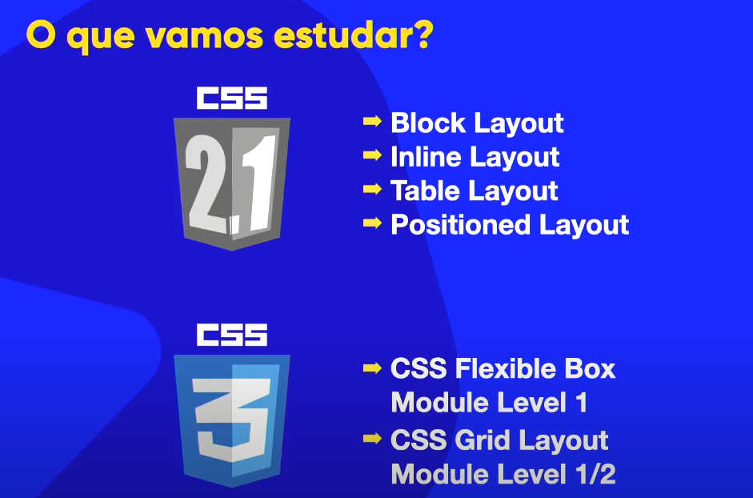

Se eu por no jarro, é um formato de um jarro
Se eu por na garrafa é um formato de uma garrafa
Se eu por no copo é o formato de um copo

A forma da água vai depender do recepiente em que ela estiver

 

O flexbox é para resolver problemas onde as caixas não estão se encaixando. Ele cria um layout mega flexível para adaptar o conteúdo

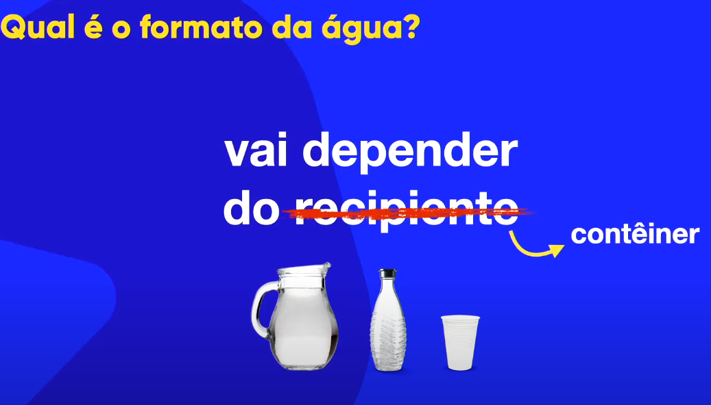

No flexbox nós não conseguimos dizer efetivamente o tamanho da caixa, o conteúdo da caixa e o contener nela, vão definir o tamanho e formato dela.

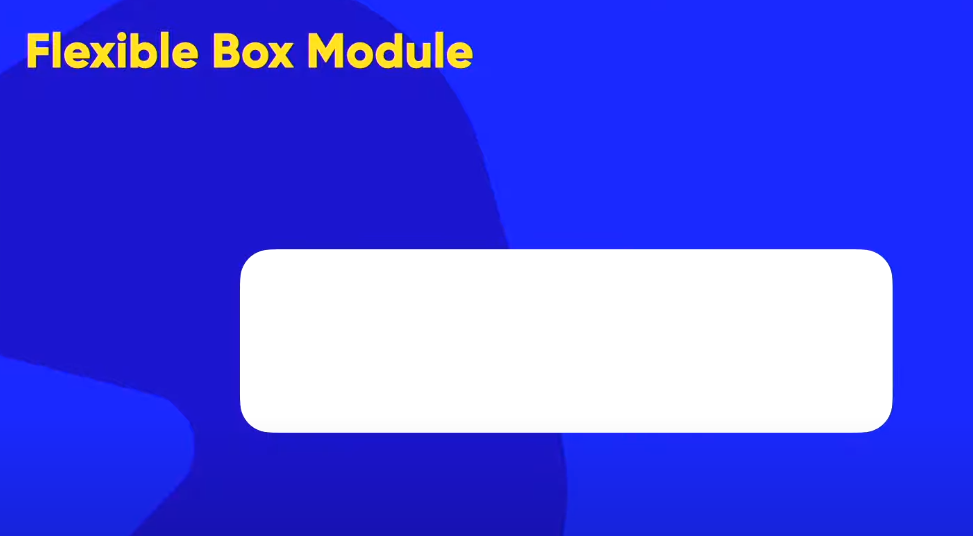
Dentro dessas caixas flexíveis nós podemos criar caixas dentro que chamamos de **itens**

Oque acontece se eu não usar o Flex Box Module?

Se eu alterar o formato do contener de fora, o contener de dentro não irá se adaptar, gerando um transbordamento

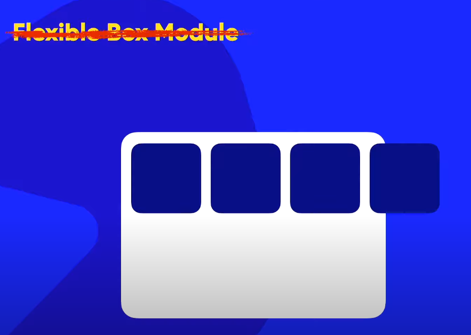

Agora com o Flex Box:

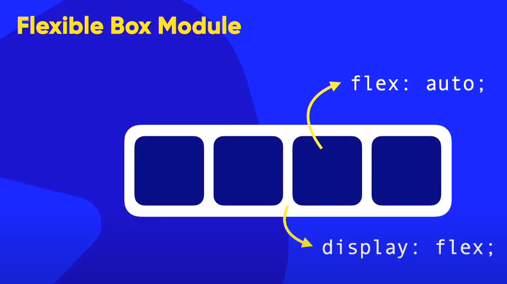

a grande maioria dos celular e computadores suportam flexbox hoje em dia, entretanto, algumas smarTvs antigas podem não suportar

Se eu der uma reduzida na caixa de fora:

elas se tornaram **fluídas**

Eu posso escolher a posição dos itens

Quando usamos o flexbox a propriedade **stretch** ja vem ligada que estica e encolhe dinamicamente

Também podemos configurar pra ter um deslocamento inferior

Podemos fazer com que essa caixa que quebrou fique adaptável ao contenner

Também podemos reconfigurar o flexbox para trabalhar com caixas verticalmente alinhadas

E que também podem se adaptar

**Só colocamos o display flex no contenner**

**Os itens não vão receber a configuração do display flex, eles vão receber outras configurações**

Flex-container = Pai

Flex-items = filhos

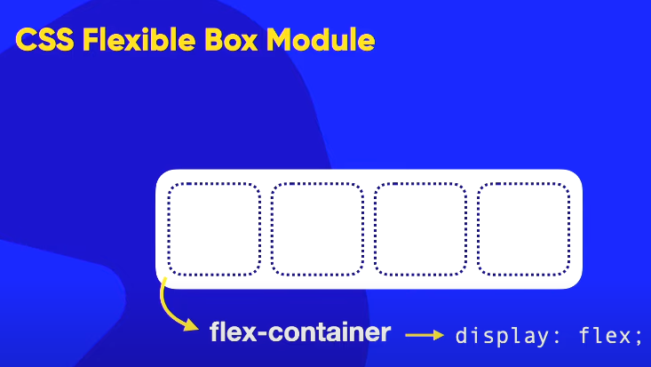

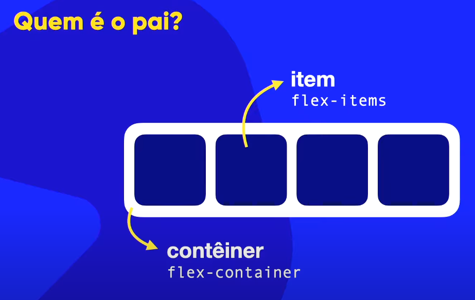

# Direções e Eixos

## Direções
As configurações de direções são realizadas no pai

### Propriedades do flex-direction

Por padrão a propriedade é **flex-direction: row;**
da esquerda pra direita (direção da leitura)

**flex-direction: row-reverse;** - Modo reverso, os elementos serão postos da direita pra esquerda

**flex-direction: row-column;** - Elementos serão postos de cima pra baixo muito utilizado pra celulares

**flex-direction: column-reverse;** - Os elementos serão postos de baixo para cima

## Eixos

### Propriedades do main-axis

O primeiro eixo que é criado é o eixo principal, conhecido como **main-axis**. Cada eixo possui dois pontos, o ponto inicial e o ponto final, **main-start** e **main-end**

### Propriedades do eixo transversal cross-axis

O principal eixo transversal que é criado é conhecido como **cross-axis**. Cada eixo possui dois pontos, o ponto inicial e o ponto final, **cross-start** e **cross-end**

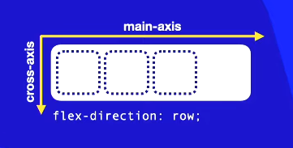
> Quando o flex direction row estiver configurado por padrão no nosso idioma

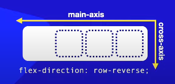

> Quando o flex direction row-reverser estiver configurado o main-axis inverte e o cross-axis não tem inversão

> Quando o flex direction column estiver configurado o main-axis vai de cima pra baixo e o cross-axis segue a direção padrão que é da esquerda pra direita

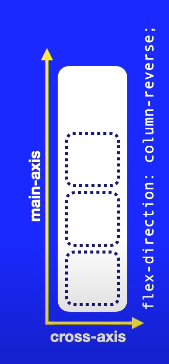
> Quando o flex direction column-reverse estiver configurado o main-axis vai de baixo pra cima e o cross-axis segue a direção padrão que é da esquerda pra direita

# Empacotamento e fluxo no Flexbox

## Flex-wrap

### nowrap

Configura o comportamento da capsula/contêiner. Por padrão ele vem configurado como **flex-wrap: nowrap;**. nowrap = não encapsule / não quebre os conteúdos

Eu tinha um espaço vazio, agora não tenho mais, oque vai acontecer se esse conteiner diminuir ainda mais?

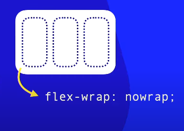
>Se eu diminuir eles vão encolher. O encolhimento dos blocos vão depender do conteúdo que existe nele

Com a propriedade **nowrap** que vem como padrão diz "não quebre, não faça com que os blocos saiam da sequência ordenada"

Quando põe display:flex em um pai, ele ja vem como padrão o **nowrap**

### wrap

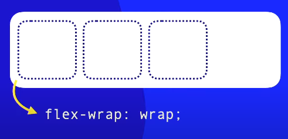
>Quando diminui o comportamento é exatamente igual ao nowrap

>A partir do momento que acaba o espaço e tento diminuir, ele vai pegar o último elemento e vai quebrar ele no sentido do eixo transversal

### wrap-reverse

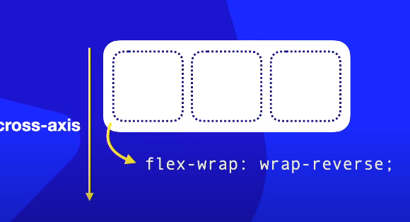

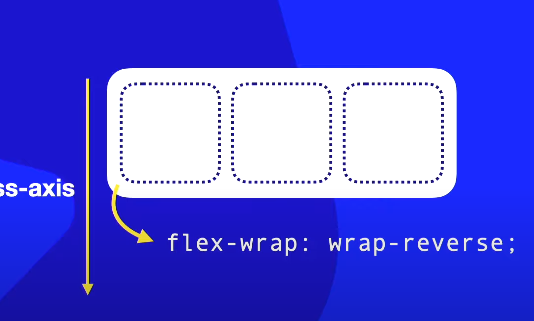

>Quando ele diminuir depois do limite dos conteúdos, ele vai ter a quebra no sentido oposto do eixo transversal

## Resumo

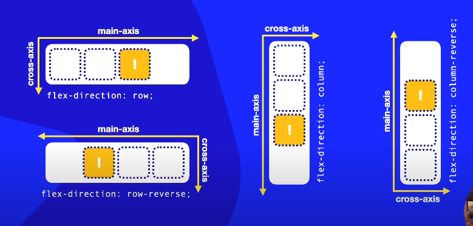

> Ele sempre está seguindo no sentido do cross-axis

> Vai fazer com que a quebra aconteça no sentido oposto ao eixo transversal

## Flex-flow

Flex-flow é uma junção entre flex-direction com flex-wrap. Ele é um *shorthand* basicamente

# Alinhamento nos eixos Flebox

Vamos aprender sobre as propriedades **justify-content** e **align-items**. Essas duas propriedades são configuráveis dentro do contêiner

Vamos aprender como alinhar os itens tanto no eixo principal como no eixo transversal

## Alinhamento do eixo principal: Justify-content

Irá fazer o alinhamento em relação ao *main-axis*, ao eixo principal. Se o *main-axis* for em pé com as configurações *column* ele vai alinhar verticalmente.

### justify-content: flex-start

É a configuração de alinhamento padrão.

**flex-start** está relacionado ao *main-start*. O primeiro item vai ficar grudado exatamente no *main-start*. Caso exista um espaço livre, **o espaço livre vai ficar sempre no final, perto do main-end**

### justify-content: flex-end

**flex-end** está relacionado ao *main-start*. O último item vai ficar grudado exatamente no *main-end*. Caso exista um espaço livre, **o espaço livre vai ficar todo condencado, perto do main-stat**

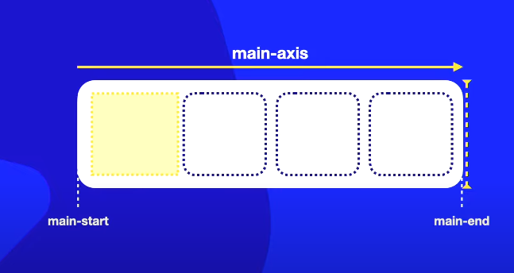

### justify-content: center

Ele vai calcular o centro do conteiner, coloca todos os itens juntos nesse center, no meio do main-axis, e os espaços em branco vão ser distribuídos de forma igual

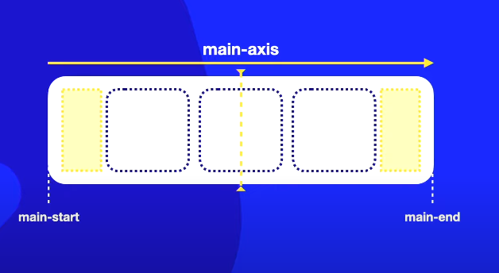

### justify-content: space-between

È uma configuração de espaçamento que coloca o primeiro item no main-start e o ultimo item no main-end. Todos os outros item vão estar no meio com o espaçamento entre eles iguais.

### justify-content: space-evenly

È uma configuração de espaçamento que não irá grudar o primeiro e o ultimo elemento nas extremidades do conteiner. Ele irá colocar os elementos dispostos dentro do contêiner de forma que antes e depois dos itens nós tenhamos espaçamentos iguais

É a configuração mais simétrica de todas as outras

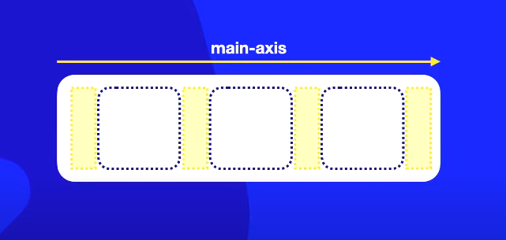

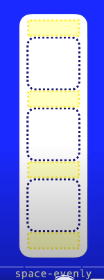

### justify-content: space-around

Vai fazer uma conta diferente. Quantos elementos o meu flex-box vai ter? 3 elementos. Então ele vai pegar o espaço útil do conteinêr, vai dividir os espaços em 3 pedaços iguais e vai centralizar os itens dentro desses espaços.

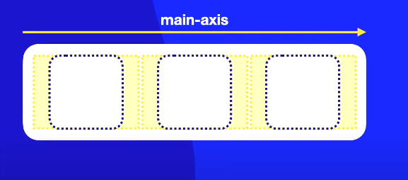
> Entre os elementos existem dois espaços, um que é o final do anterior, e o outro que é o ínicio do posterior

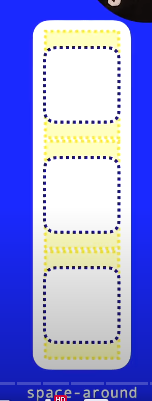

### Resumo

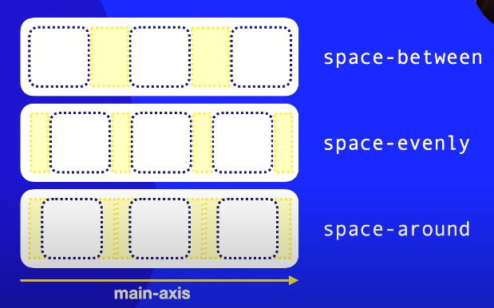

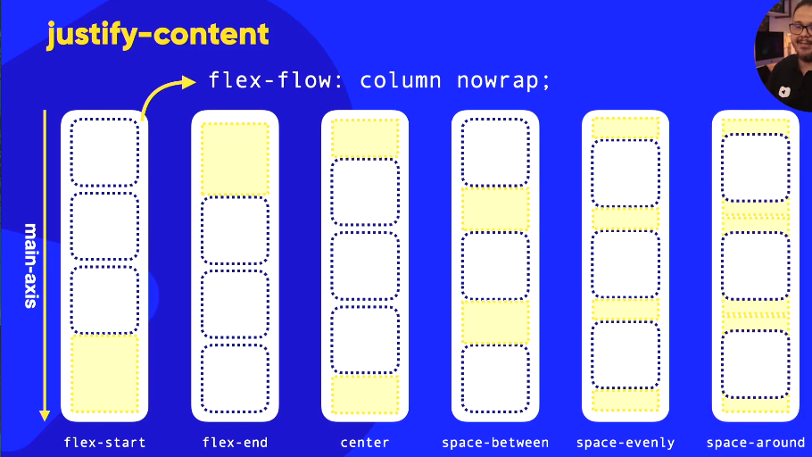

## Alinhamento do eixo transversal: align-items

Irá funcionar sempre no sentido do cross-exis que é o eixo transversal, se for com a configuração row, é de cima pra baixo.

Para poder alinhar no cross-axis precisará aumentar a altura do conteiner.

Por padrão é **stretch**

### align-items: stretch

Se aumentar o cross-axis ele irá esticar os elementos

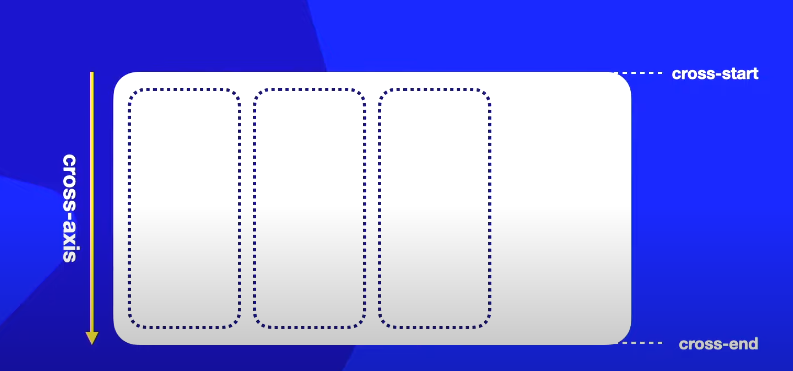
>Os itens irão se esticar

### align-items: flex-start

Vai fazer os elementos grudarem no ínicio do eixo transversal, deixando um espaço vazio no final do eixo transversal

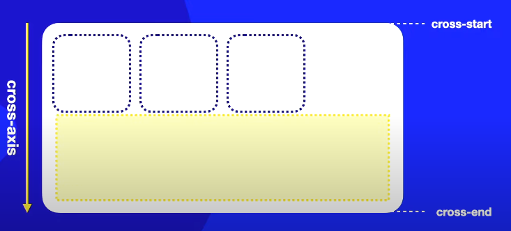

### align-items: flex-end

Vai fazer os elementos grudarem no final do eixo transversal, deixando um espaço vazio no inicio do eixo transversal

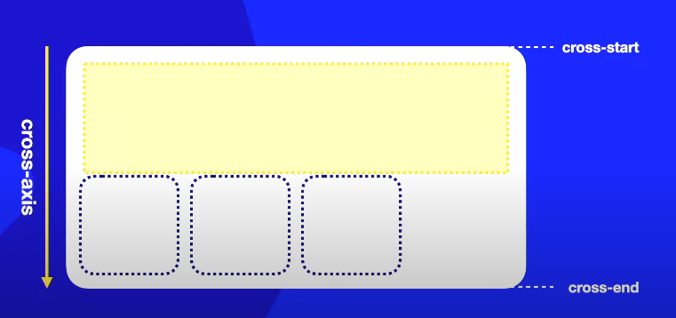

### align-items: center

Vai fazer os elementos grudarem no centro do eixo transversal, deixando um espaço vazio no inicio do eixo transversal e no final do eixo transversal

O align-items não tem configurações de espaçamento como o space-around, space-between e space-evenly existe uma outra propriedade que faz isso.

# Centralização Absoluta Flexbox

**Objetivo:**

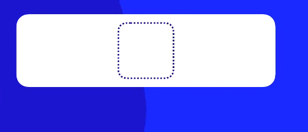

Idependente do formato do conteiner o item vai ficar sempre no meio

Se eu mudar a qualquer momento o formato do conteiner

> O item continua centralizado

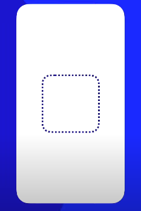
> O item continua centralizado. 

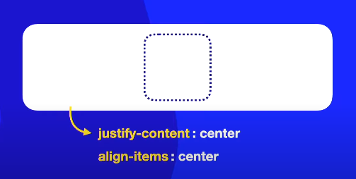
> Coloco essas duas propriedades com o valor center. Sempre no conteiner
