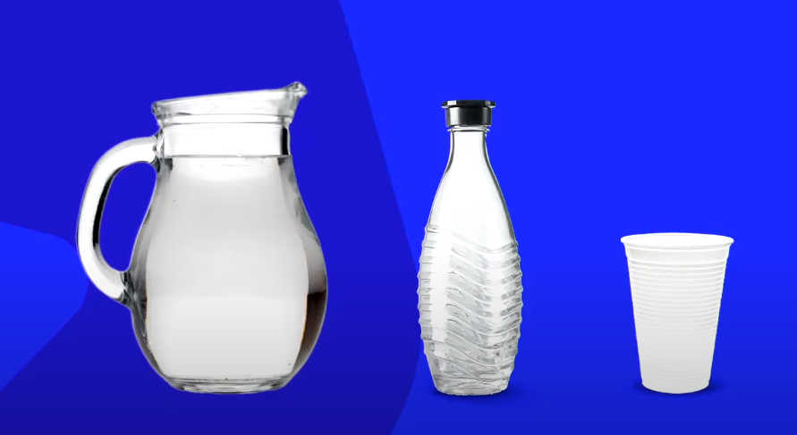
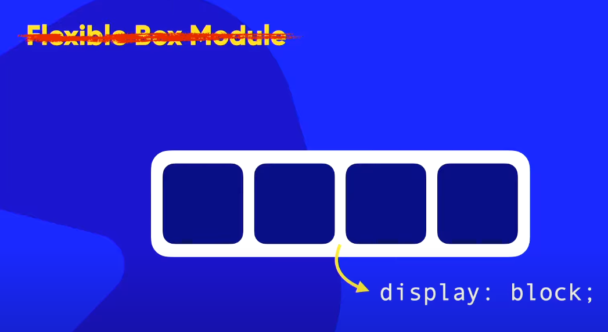
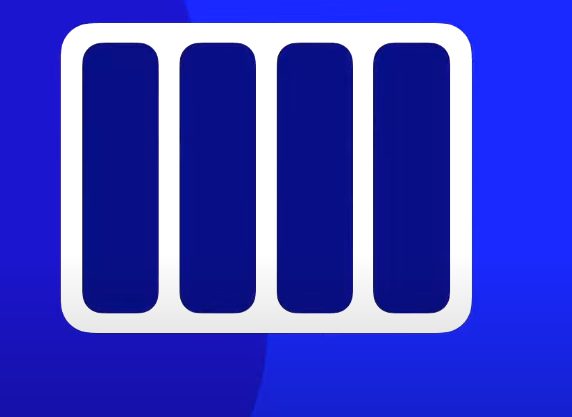
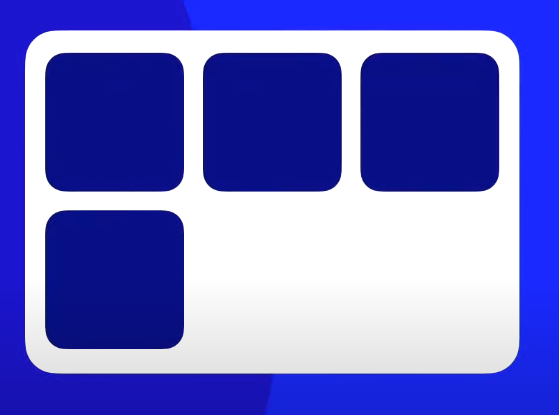
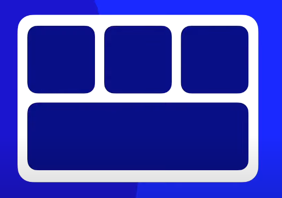
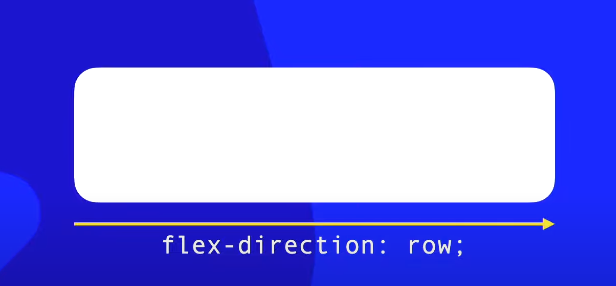
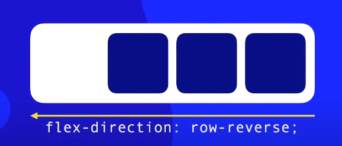
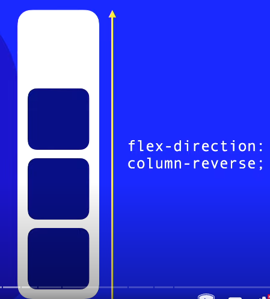
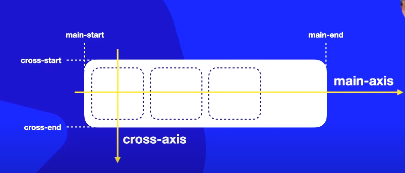

Qual é o formato da água?

Se eu por no jarro, é um formato de um jarro
Se eu por na garrafa é um formato de uma garrafa
Se eu por no copo é o formato de um copo

A forma da água vai depender do recepiente em que ela estiver

 

O flexbox é para resolver problemas onde as caixas não estão se encaixando. Ele cria um layout mega flexível para adaptar o conteúdo

No flexbox nós não conseguimos dizer efetivamente o tamanho da caixa, o conteúdo da caixa e o contener nela, vão definir o tamanho e formato dela.

Dentro dessas caixas flexíveis nós podemos criar caixas dentro que chamamos de **itens**

Oque acontece se eu não usar o Flex Box Module?

Se eu alterar o formato do contener de fora, o contener de dentro não irá se adaptar, gerando um transbordamento

Agora com o Flex Box:

a grande maioria dos celular e computadores suportam flexbox hoje em dia, entretanto, algumas smarTvs antigas podem não suportar

Se eu der uma reduzida na caixa de fora:

elas se tornaram **fluídas**

Eu posso escolher a posição dos itens

Quando usamos o flexbox a propriedade **stech** ja vem ligada que estica e encolhe dinamicamente

Também podemos configurar pra ter um deslocamento inferior

Podemos fazer com que essa caixa que quebrou fique adaptável ao contenner

Também podemos reconfigurar o flexbox para trabalhar com caixas verticalmente alinhadas

E que também podem se adaptar

**Só colocamos o display flex no contenner**

**Os itens não vão receber a configuração do display flex, eles vão receber outras configurações**

Flex-container = Pai
Flex-items = filhos

# Direções e Eixos

## Direções
As configurações de direções são realizadas no pai

### Propriedades do flex-direction

Por padrão a propriedade é **flex-direction: row;**
da esquerda pra direita (diração da leitura)

**flex-direction: row-reverse;** - Modo reverso, os elementos serão postos da direita pra esquerda

**flex-direction: row-column;** - Elementos serão postos de cima pra baixo muito utilizado pra celulares

**flex-direction: column-reverse;** - Os elementos serão postos de baixo para cima

## Eixos

### Propriedades do main-axis

O primeiro eixo que é criado é o eixo principal, conhecido como **main-axis**. Cada eixo possui dois pontos, o ponto inicial e o ponto final, **main-start** e **main-end**

### Propriedades do eixo transversal cross-axis

O principal eixo transversal que é criado é conhecido como **cross-axis**. Cada eixo possui dois pontos, o ponto inicial e o ponto final, **cross-start** e **cross-end**

> Quando o flex direction row estiver configurado por padrão no nosso idioma

> Quando o flex direction row-reverser estiver configurado o main-axis inverte e o cross-axis não tem inversão

> Quando o flex direction column estiver configurado o main-axis vai de cima pra baixo e o cross-axis segue a direção padrão que é da esquerda pra direita

> Quando o flex direction column-reverse estiver configurado o main-axis vai de baixo pra cima e o cross-axis segue a direção padrão que é da esquerda pra direita